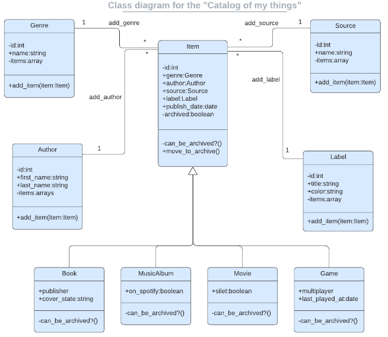

<a name="readme-top"></a>

# 📗 Table of Contents
- [📖 About the Project](#about-project)
  - [🛠 Built With](#built-with)
    - [Tech Stack](#tech-stack)
    - [Key Features](#key-features)
- [💻 Getting Started](#getting-started)
  - [Setup](#setup)
  - [Prerequisites](#prerequisites)
- [👥 Authors](#authors)
- [🔭 Future Features](#future-features)
- [🤝 Contributing](#contributing)
- [⭐️ Show your support](#support)
- [🙏 Acknowledgements](#acknowledgements)
- [📝 License](#license)

   # :book: Ruby-group-capstone<a name="about-project"></a>
  In this project, we created a console app that will help us to keep a record of different types of things we own: books, music albums, movies, and games. Everything is based on the UML class diagram presented below. The data is preserved in JSON files. However we have also prepared a database with tables structure analogical to program's class structure.

  
## :hammer_and_wrench: Built With <a name="built-with"></a>
### Tech Stack <a name="tech-stack"></a>

- Ruby
<p align="right">(<a href="#readme-top">back to top</a>)</p>

 ### Key Features <a name="key-features"></a>
 - Tests

<p align="right">(<a href="#readme-top">back to top</a>)</p>


### Video Presentation
<a href="https://drive.google.com/file/d/1U0FiF5JA6D-Zp3KiUL-DHZBlc9EDI3bb/view?usp=sharing">Check out video presentation</a>

## :computer: Getting Started <a name="getting-started"></a>
To get a local copy up and running, follow these steps.

### Prerequisites
In order to run this project you need:
  - Terminal to run the _irb_ console
### Setup
Clone this repository to your desired folder: 

```
git clone https://github.com/mahdinoori2000/ruby-group-capstone.git
```

Access it by:

```
cd ruby-group-capstone
```

and after run,

```
bundle install
```

### Run the app 
for running the app, run below command
```
ruby main.rb
```

### Run the tests 
for running the tests, run below command
```
rspec
```

## :busts_in_silhouette: Authors <a name="authors"></a>
:bust_in_silhouette: *Mahdi Noori*
- GitHub: [@mahdinoori](https://github.com/mahdinoori2000)
- LinkedIn: [Mahdi Noori](https://www.linkedin.com/in/mahdi-noori-hc201/)

:bust_in_silhouette: *Cephas TOKOLI*
- GitHub: [@Ctokoli](https://github.com/ctokoli/)
- Twitter: [@Ctokoli](https://twitter.com/ctokoli)
- LinkedIn: [Cephas Tokoli](https://www.linkedin.com/in/ctokoli)

:bust_in_silhouette: *Marie Grace BAHATI*
- GitHub: [@mariegrace31](https://github.com/mariegrace31)
- Twitter: [@mariegracebmg](https://twitter.com/mariegracebmg)
- LinkedIn: [Marie Grace Bahati](www.linkedin.com/in/marie-grâce-bahati)

:bust_in_silhouette: *Kerlos BAHAA*
- GitHub: [@kerlosbahaa](https://github.com/kerlos-bahaa)
- LinkedIn: [Marie Grace Bahati](https://www.linkedin.com/in/kerlos-bahaa/)

<p align="right">(<a href="#readme-top">back to top</a>)</p>

## :star:️ Show your support <a name="support"></a>
If you like this project give a star.
<p align="right">(<a href="#readme-top">back to top</a>)</p>

## :handshake: Contributing <a name="contributing"></a>
Contributions, issues [page issues](https://github.com/mahdinoori2000/ruby-group-capstone/issues), and feature requests are welcome!
<p align="right">(<a href="#readme-top">back to top</a>)</p>

## :pray: Acknowledgments <a name="acknowledgements"></a>
I would like to thank  Microverse for this opportunity.
<p align="right">(<a href="#readme-top">back to top</a>)</p>

## :memo: License <a name="license"></a>
This project is [MIT](./MIT.md) licensed.
<p align="right">(<a href="#readme-top">back to top</a>)</p>